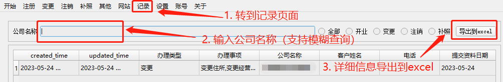

# 操作流程说明
请按照次说明，进行相关操作，以正确生成文档。  
  
业务流程：1. 客户接待，填报联系人信息，勾选变更登记内容  2. 调取最近一次工商变更档案  3. 提交材料（执照、公章、相关证明等）  4. 变更信息填报  5. 生成文档  6. 审核材料（必须提交的附件材料等） 7. 报送市场监督管理局审批  7. 领取执照。  

1. 填写客户接待页面的详细信息

2. 转到具体变更内容填写页面

3. 如有职务变更的，填写职务变更信息

4. 如有股权变更的，填写转让协议和变更后的股权信息，再确认勾选股权变更

5. 变更记录查询
